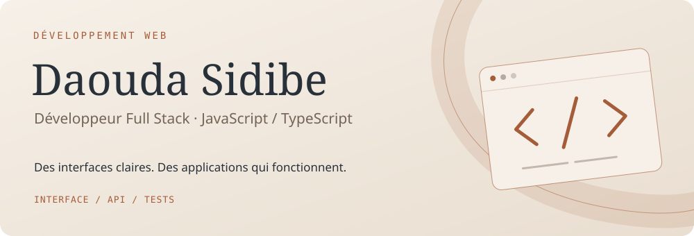
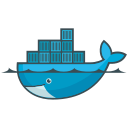
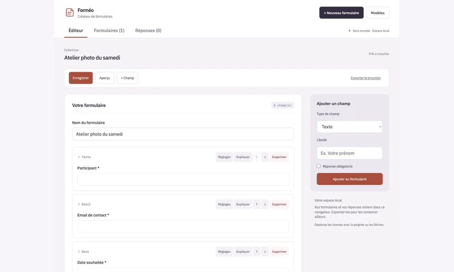
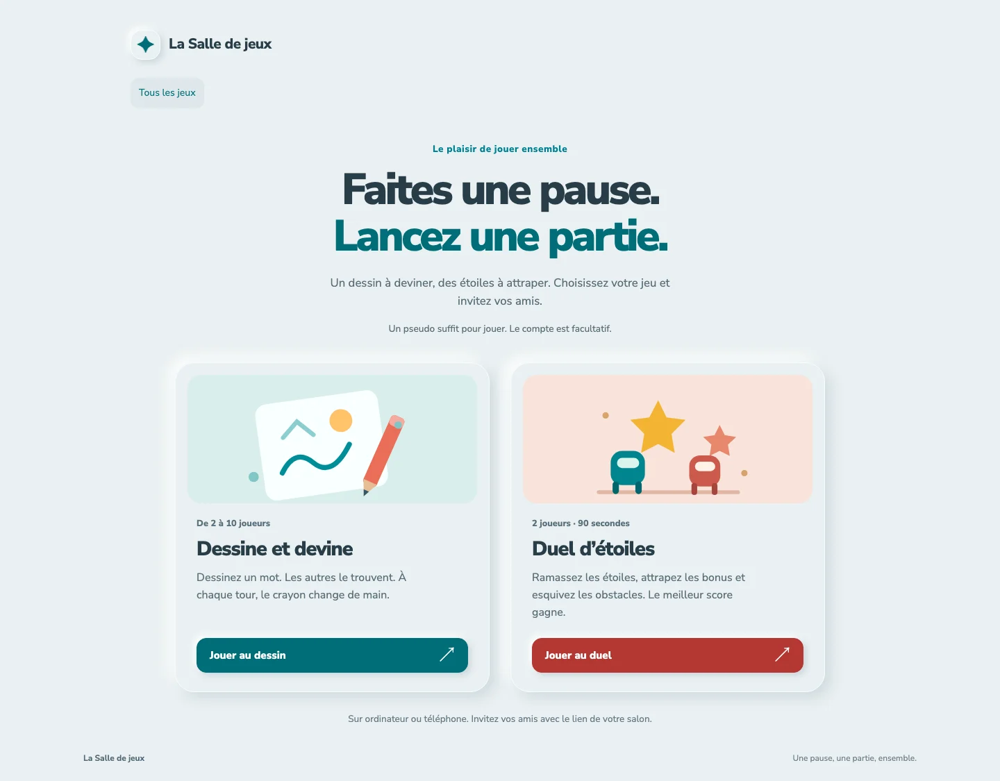
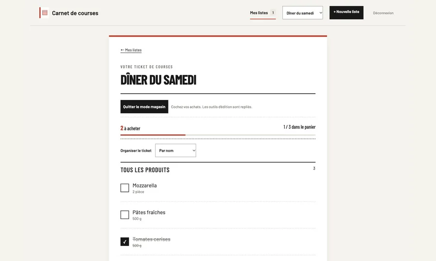
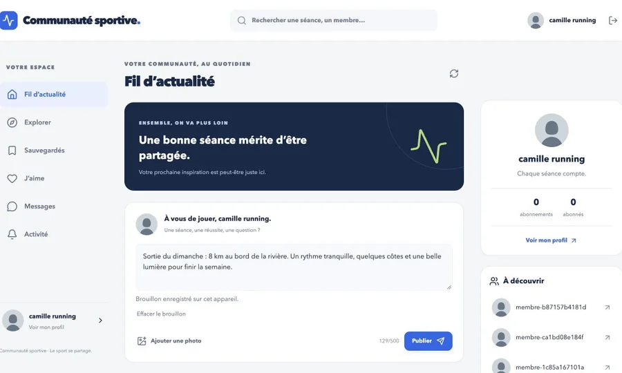
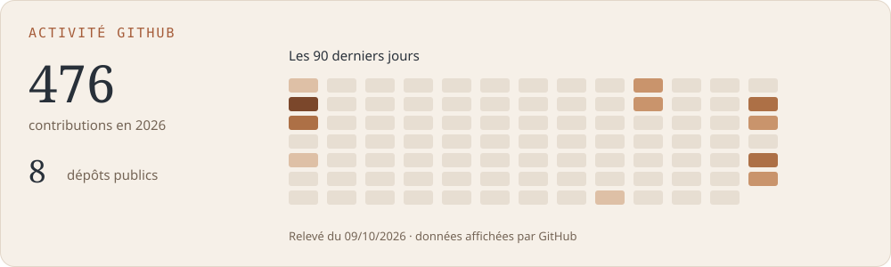

<picture>
  <source media="(prefers-color-scheme: dark)" srcset="assets/header-dark.svg">
  <source media="(prefers-color-scheme: light)" srcset="assets/header-light.svg">
  
</picture>

  
  
  

### Bonjour, moi c’est Daouda 👋

Je développe des applications web, de l’interface à l’API. J’aime rendre les parcours simples, comprendre les cas qui font dérailler une fonctionnalité et les couvrir avec des tests.

Je travaille avec **JavaScript et TypeScript**, sur **React, Vue et Nuxt**, ainsi que **Node.js et NestJS**. Mes projets personnels sont aussi un terrain d’expérimentation : jeux multijoueurs, outils du quotidien et [portfolio 3D](https://www.daoudasidibe.fr), dont j’ai construit la scène avec Blender.

## Technologies

   &nbsp;
   &nbsp;
   &nbsp;
   &nbsp;
   &nbsp;
   &nbsp;
   &nbsp;
   &nbsp;
   &nbsp;
  

**Interfaces** · React, Vue, Nuxt, HTML, CSS 
**API & données** · Node.js, NestJS, REST, SQL, MongoDB 
**Qualité & livraison** · Jest, Cypress, Git, Docker, GitLab CI/CD

## Quelques fenêtres sur mes projets

<table>
  <tr>
    <td width="50%" valign="top">
      
      <h3>Forméo</h3>
      
Composer un formulaire, prévisualiser ses champs et recueillir les réponses. Sans compte, avec les données conservées dans le navigateur.

      <a href="https://formeo-daouda.vercel.app">Ouvrir l’application ↗</a> · <a href="https://github.com/daoudasidibe224/formeo">Code source</a>
    </td>
    <td width="50%" valign="top">
      
      <h3>La Salle de jeux</h3>
      
Dessine et devine et Duel d’étoiles réunis dans un même site. Un pseudo suffit ; les deux jeux partagent le même accès.

      <a href="https://duel-etoiles-en-ligne.onrender.com">Jouer ↗</a> · <a href="https://github.com/daoudasidibe224/salle-de-jeux">Code source</a>
    </td>
  </tr>
  <tr>
    <td width="50%" valign="top">
      
      <h3>Carnet de courses</h3>
      
Préparer plusieurs listes, organiser les produits par rayon et cocher les achats dans un ticket pensé pour le magasin.

      <a href="https://carnet-de-courses.onrender.com">Préparer une liste ↗</a> · <a href="https://github.com/daoudasidibe224/carnet-de-courses">Code source</a>
    </td>
    <td width="50%" valign="top">
      
      <h3>Communauté sportive</h3>
      
Partager ses séances, découvrir d’autres profils sportifs et échanger autour de ses activités.

      <a href="https://communaute-sportive.onrender.com">Découvrir la communauté ↗</a> · <a href="https://github.com/daoudasidibe224/communaute-sportive">Code source</a>
    </td>
  </tr>
</table>

### À découvrir aussi

| Application | Ce qu’on peut y faire | Liens |
| :--- | :--- | :--- |
| **Mes listes de tâches** | Organiser ses listes, ses priorités et ses échéances. | [Démo](https://mes-listes-de-taches.onrender.com) · [Code](https://github.com/daoudasidibe224/mes-listes-de-taches) |
| **Carnet de cartes de visite** | Créer, retrouver et classer ses cartes de visite. | [Démo](https://carnet-de-cartes-de-visite.onrender.com) · [Code](https://github.com/daoudasidibe224/carnet-de-cartes-de-visite) |

Les démos hébergées gratuitement sur Render peuvent prendre un moment à démarrer après une période d’inactivité.

## Au fil des contributions

<picture>
  <source media="(prefers-color-scheme: dark)" srcset="assets/activity-dark.svg">
  <source media="(prefers-color-scheme: light)" srcset="assets/activity-light.svg">
  
</picture>

Ces visuels sont générés depuis les données affichées par GitHub et actualisés chaque jour.
